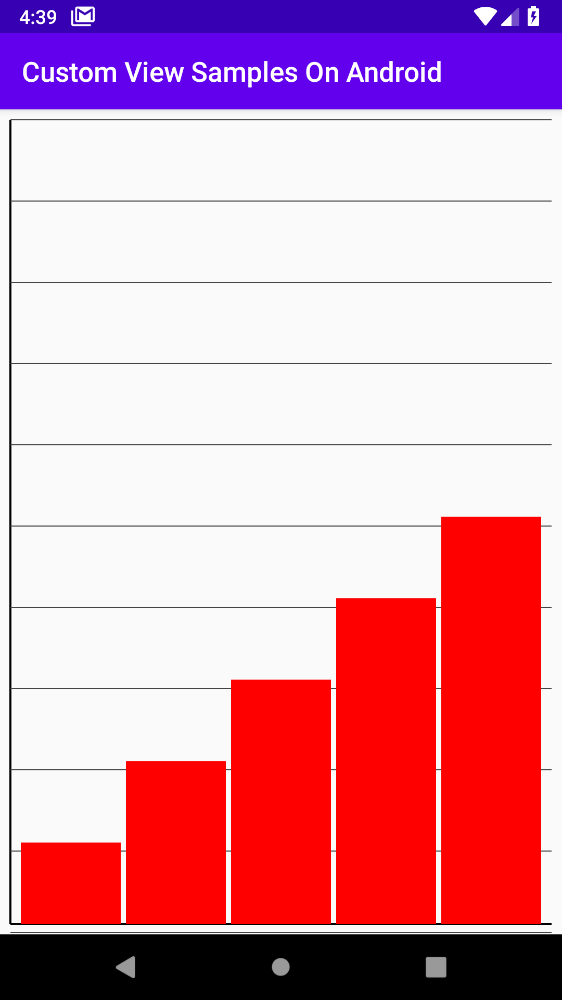
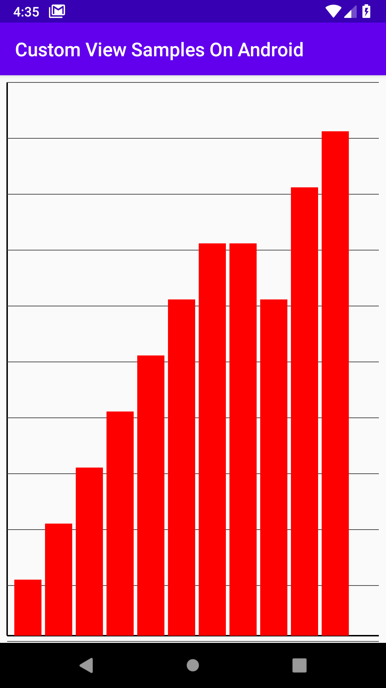
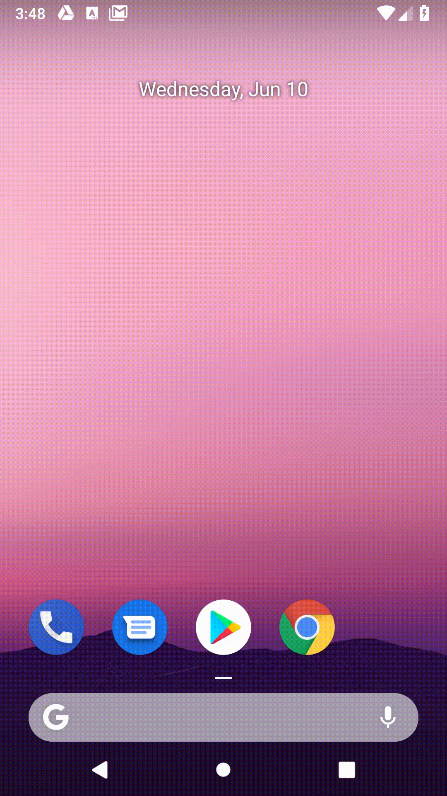
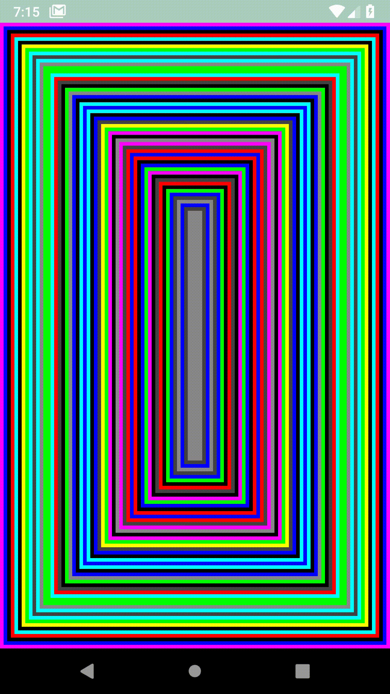

# Custom View Samples On Android

I love **Custom Views** on Android because they provide the power to create anything you think of, understanding the fundamentals of custom
views automatically simplifies the replication of any design out there. Well, no one can *stop* learning, so as I go on, and come across
challenging views, I replicate them, add a screenshot of the built view, a link to the code, and a walkthrough on how it was built.
Check them out!

## ChartView

  Actually I came across this during a talk about custom views, and I wanted to replicate it, it went fine, and this was the layout with
variable data.

 
  
  The image to the left has 5 bars while the one to the right has 10?. Well the way I started off was to draw the main and cross axes, 
I created a paint object and drew the x and y axes with the appropriate colors, after that I divided the height of the screen by 10, so
as to know the exact spacing needed between the graph lines. Then I divided the width of the screen minus the padding, the width of the
left axis, and the default spacing by the amount of bars to be drawn. I then calculate by the percent of the bar, the height of the bar is
deduced. You can go through the code <a href="https://github.com/OlaoreFouad/custom-view-samples-on-android/blob/master/app/src/main/java/dev/olaore/customviewsamplesonandroid/views/ChartView.kt">here</a>

## MyTextView

  After spending some time with drawing text on android, it was amazing!, I could easily control how text was being drawn on the Android
canvas, make modifications and style the text to suit my needs. I learnt how to do various things like alter scale, spacing, size, font
and among many others, this is is sample application I built that showcases most of the aforementioned sugar do-able with text drawing on canvas

You can go through the code <a href="https://github.com/OlaoreFouad/custom-view-samples-on-android/blob/master/app/src/main/java/dev/olaore/customviewsamplesonandroid/views/MyTextView.kt">here</a>

## RepeatedRectView

  I've had this idea of creating a pattern by repeating rectangles on a canvas by moving its origin by a certain inset value. I had to get half of the width of the screen, so as to know how many rectangles it could accomodate, depending on the spacing provided (10). That's what I did here. I started drawing at the origin, then moved in by 10 on both axes, then moved inside again and again until the threshold was met. And voila!, this beauty came out!. I also added a touchevent listener that redraws the views on-click.

You can go through the code <a href="https://github.com/OlaoreFouad/custom-view-samples-on-android/blob/master/app/src/main/java/dev/olaore/customviewsamplesonandroid/views/RepeatedRectView.kt">here</a>
